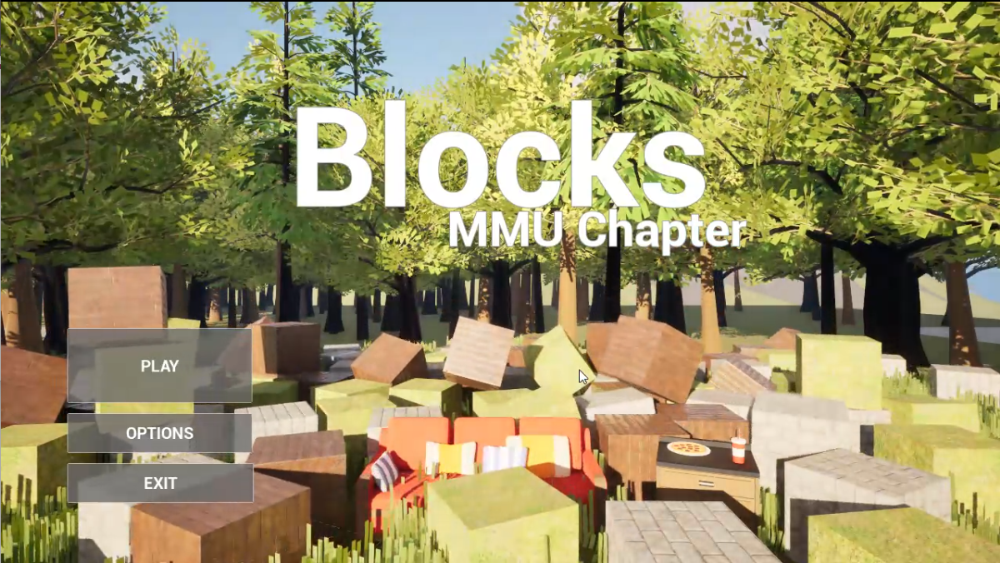
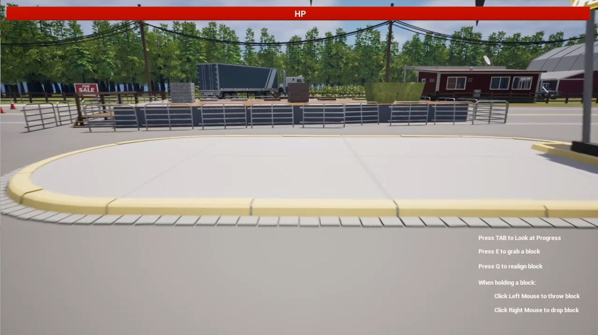
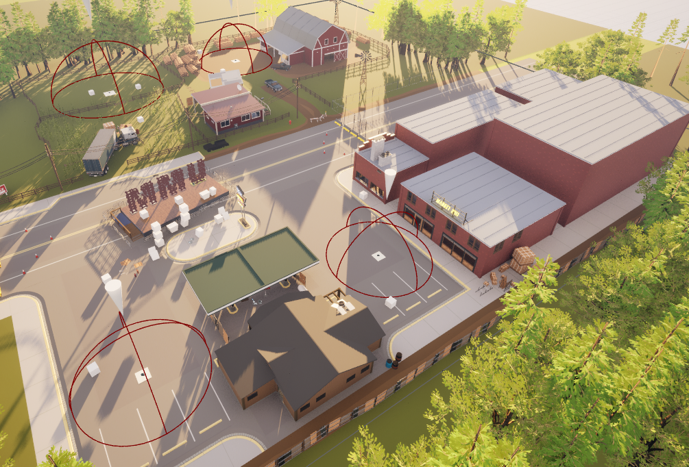
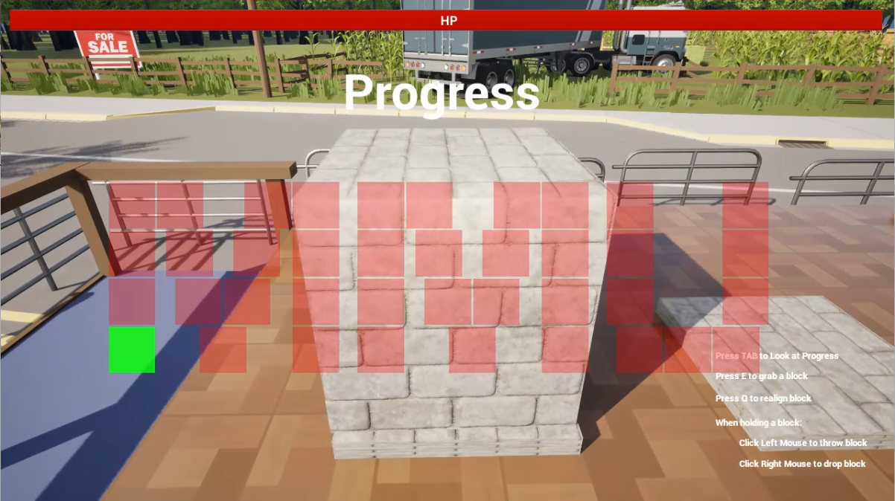
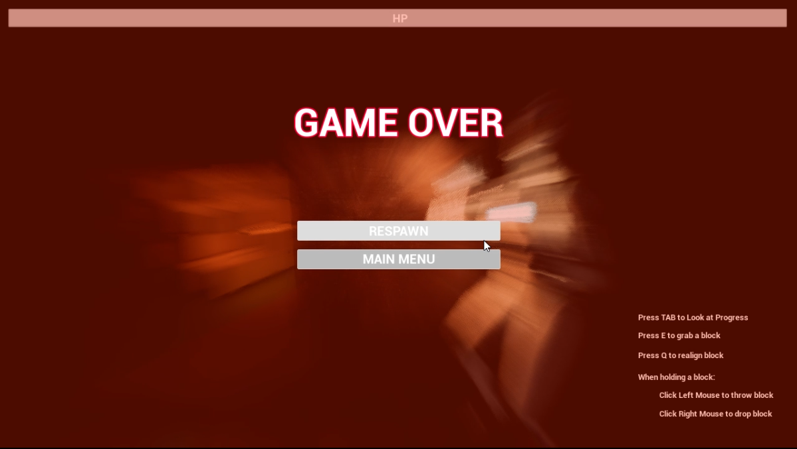

# Blocks

A small project to practice Unreal Engine 5 physics simulation. This is a first-person video game with minor action elements.

  
  
  

## Gameplay

Players control the in-game character to explore the sorrowful world using these controls:

| Control | Key |
| --- | --- |
| Move | WSAD |
| Camera | Move Mouse |
| Pick up object | E |
| Realign block | Q |
| While holding a block: Throw | Left click |
| While holding a block: Drop | Right click |
| Pause | P |

## Key Features

### Puzzle System

Look for the necessary blocks (three types of blocks: brick, grass and wood) that matches the placement. The final shape is as below where the first letter must be match with the first type of block.

  

### Enemy

Enemies spawn randomly on three different spots where enemies will drop the corresponding blocks depending on where the spawner is. The enemies has a simple AI where they will follow the players when they are close and players can defeat the enemies by launching blocks onto them.  Colliding with the enemies reduce the health, ultimately ends the game.

## Installation Guide

Here are the steps to install the development version of this game on your device:

### Prerequisites

1. Download source code from this repository.
2. Download and install [Unreal Engine 5](https://www.unrealengine.com/en-US/unreal-engine-5).

### Open Unreal Engine 5

After downloading UE5, run it by opening the application.

### Import the project

File > Open project > Choose the file (usually .uproject extension).

### Run the game

Locate the Play button usually, represented by a green triangle.
